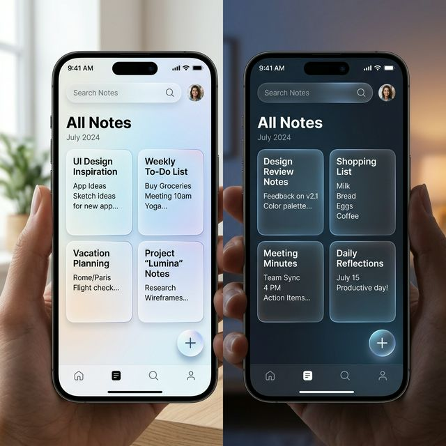
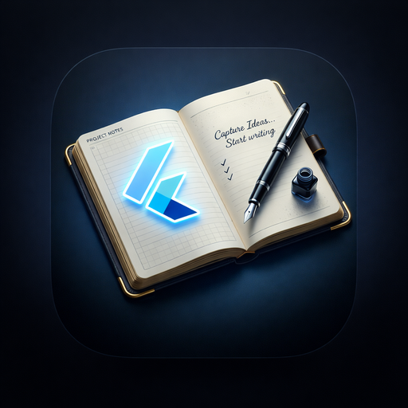

# 📝 Advanced Notepad

**A premium, hybrid online/offline note-taking experience for Android.**

Advanced Notepad is more than just a place to jot down thoughts. It integrates **high-performance local storage (Hive)**, **real-time cloud synchronization (Firestore)**, and **secure digital signatures** into a single, beautifully designed application.

---

## ✨ Key Features

- 🚀 **Hybrid Architecture**: Fast local access with Hive; transparent background sync to Firebase Firestore.
- 🖋️ **Digital Signatures**: Add a personal touch or verify your notes by drawing digital signatures.
- 📂 **Smart Organization**: Category badges, pinning, archiving, and trash management.
- 🔍 **Advanced Filtering**: Filter by date, presence of signatures, or photos.
- 🔔 **Push Notifications**: Stay updated with real-time alerts from Firebase Cloud Messaging.
- 💎 **Premium UI**: Glassmorphism design, smooth animations, and a rotating rainbow border for that extra touch.
- 🌍 **Localized Support**: A built-in support page for donations and developer info that works perfectly offline.
- 🛡️ **Stay Updated**: Automatic update alerts integrated via the `upgrader` package.

---

## 📱 How to Use - Onboarding Guide

### 1. Launch & Onboarding
Upon the first launch, you'll be greeted by a premium onboarding screen that introduces the core features: **Offline First**, **Cloud Sync**, **Secure Signatures**, and **Notifications**.

### 2. Creating & Editing Notes
Tap the **+** button at the bottom right. Use the rich text editor to write your thoughts. You can also tap the **Signature icon** to draw a custom signature on your note.

### 3. Organizing Your Workspace
- **Pin**: Keep important notes at the top.
- **Archive**: Hide completed tasks from your main view.
- **Favorite**: Mark notes you truly love.
- **Trash**: Safely delete notes (with a 30-day recovery window).

### 4. Advanced Filtering
Tap the **Filter icon** in the top bar to sort by date, find notes with signatures, or see only those with photos.

---

## 📸 Screenshots & Previews

| **Home Screen (Premium UI)** | **Onboarding Flow** |
|:---:|:---:|
|  |  |

| **Advanced Filtering** | **Digital Signature** |
|:---:|:---:|
|  |  |

---

## 🛠️ Installation & Setup

1. **Clone the repository**:
   ```bash
   git clone https://github.com/Souravsanyal1/advanced_notepad.git
   ```
2. **Setup Firebase**: 
   - Add your `google-services.json` to `android/app/`.
3. **Install Dependencies**:
   ```bash
   flutter pub get
   ```
4. **Run the App**:
   ```bash
   flutter run
   ```

---

## 👨‍💻 Developer Info
- **Developer**: Sourav Sanyal
- **Email**: [sourav.sanyal.dev@gmail.com](mailto:sourav.sanyal.dev@gmail.com)
- **Portfolio**: [sourav-sanyal.pro.bd](https://sourav-sanyal.pro.bd)

---

Developed with ❤️ using Flutter.
